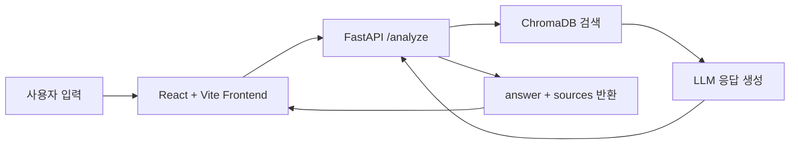

# CareerFit AI
> 취업·공모전 데이터 기반 맞춤형 AI 포트폴리오 코치

## 프로젝트 개요

취업준비생은 자신의 전공과 보유 스킬에 맞는 공고를 찾더라도, 어떤 역량이 부족한지와 포트폴리오를 어떻게 보완해야 하는지 판단하기 어렵다. 또 일반적인 AI 답변은 실제 공고 데이터를 근거로 하지 않아 신뢰성이 떨어질 수 있다.

CareerFit AI는 실제 취업공고 데이터를 ChromaDB에 저장하고, 사용자 질문과 유사한 공고를 RAG 방식으로 검색해 LLM에 전달한다. 이를 통해 공고 기반의 맞춤형 역량 분석과 준비 방향을 함께 제안한다.

## 기술 스택

| 영역 | 기술 |
|---|---|
| 백엔드 | Python, FastAPI |
| AI API | Gemini 2.5 Flash-Lite |
| 데이터 | Pandas, SQLite, ChromaDB |
| 프론트엔드 | React, Vite |
| 실행 환경 | Docker |

## 아키텍처



## 실행 방법

### Docker로 실행 (백엔드)

```bash
docker build -t careerfit-ai ./backend
docker run -p 8000:8000 --env-file backend/.env careerfit-ai
```

- API 문서: `http://localhost:8000/docs`
- 상태 확인: `http://localhost:8000/health`

### 로컬 실행

#### 1. 백엔드 실행

```bash
cd backend
source venv/bin/activate  # Windows: venv\Scripts\activate
uvicorn main:app --reload --port 8000
```

#### 2. 프론트엔드 실행

```bash
cd frontend
npm install
npm run dev
```

- 프론트 기본 주소: `http://localhost:5173`
- 프론트는 기본적으로 `http://localhost:8000` 백엔드와 연결된다.
- 필요하면 `frontend/.env`에 아래 값을 넣어 API 주소를 바꿀 수 있다.

```env
VITE_API_BASE_URL=http://localhost:8000
```

### 배포 참고

- 백엔드 Dockerfile: `backend/Dockerfile`
- 프론트 Dockerfile: `frontend/Dockerfile`
- Render 배포 가이드: `docs/render-frontend-deploy.md`

## 데이터 파이프라인

```text
CSV → Pandas 전처리 → SQLite (구조화 저장) → ChromaDB (벡터 검색)
```

전처리 실행:

```bash
cd backend
python data/preprocess.py
```

## 주요 기능

- RAG 기반 역량 분석: 취업 공고 데이터를 근거로 맞춤형 조언 제공
- 출처 표시: 어떤 공고 데이터를 참고했는지 `sources`로 함께 반환
- Mock Mode: API 한도 초과 시 `MOCK_MODE=true`로 폴백 가능
- React UI 출력: 결과 카드와 출처 카드를 프론트엔드에서 표시

## 프로젝트 구조

```text
careerfit_ai/
├── backend/          # FastAPI 서버
├── frontend/         # React + Vite UI
├── docs/             # 프로젝트 문서
├── careerfit-ai/     # 하네스/참고 가이드
├── README.md
└── MODEL_BENCHMARK.md
```

## 향후 개선

- [ ] 이력서 PDF 업로드 후 자동 역량 추출
- [ ] 공모전 마감일 알림 기능
- [ ] RAG 검색 품질 평가 지표 추가

## 개발 과정

가장 어려웠던 부분은 RAG 검색 결과를 실제 LLM 응답과 프론트 UI까지 일관되게 연결하는 작업이었다. 특히 실행 환경에 따라 ChromaDB/ONNX 검색이 실패하는 문제가 있었는데, 코드 문제와 실행 환경 문제를 분리해서 원인을 좁히고, `answer`와 `sources` 구조를 명확히 나눠 해결했다.

## Live Demo

- Frontend: https://careerfit-ai-1.onrender.com
- Backend Health: https://careerfit-ai-deak.onrender.com/health

## Developer

- Name: Dowon
- Role: Backend / AI Service Development
- GitHub: @domam7547
